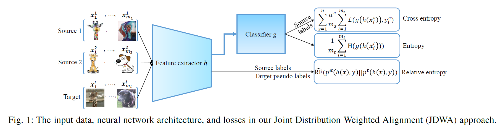

# Joint-Distribution-Weighted-Alignment

This repository provides the Pytorch code for the work "Joint Distribution Weighted Alignment for Multi-Source Domain Adaptation via Kernel Relative Entropy Estimation" published in IEEE Transactions on Multimedia, 2025. The code is a simple demonstration and can be run on a vanilla computer with the Jupyter Notebook installed. The video for introducing this work will be available soon. 

Briefly speaking, this work proposes a Joint Distribution Weighted Alignment (JDWA) approach to align a weighted joint source distribution to the joint target distribution under the relative entropy, such that the multi-source domain adaptation problem can be transformed into the familiar semi-supervised learning problem. Since the relative entropy is unknown in practice, this work also develops a Kernel Relative Entropy Estimation (KREE) method to estimate the relative entropy from data. Fig. 1 illustrates the main idea of this work. 

For the details of this work,  please refer to the paper below: 

@article{Chen2025Joint,  
  author={Sentao Chen},  
  journal={IEEE Transactions on Multimedia},   
  title={Joint Distribution Weighted Alignment for Multi-Source Domain Adaptation via Kernel Relative Entropy Estimation},   
  year={2025},      
  volume = {27},      
  pages = {6606-6619},        
  doi = {10.1109/TMM.2025.3586109}     
  }

If you have questions regarding the code, please contact me via the email sentaochenmail@gmail.com.
